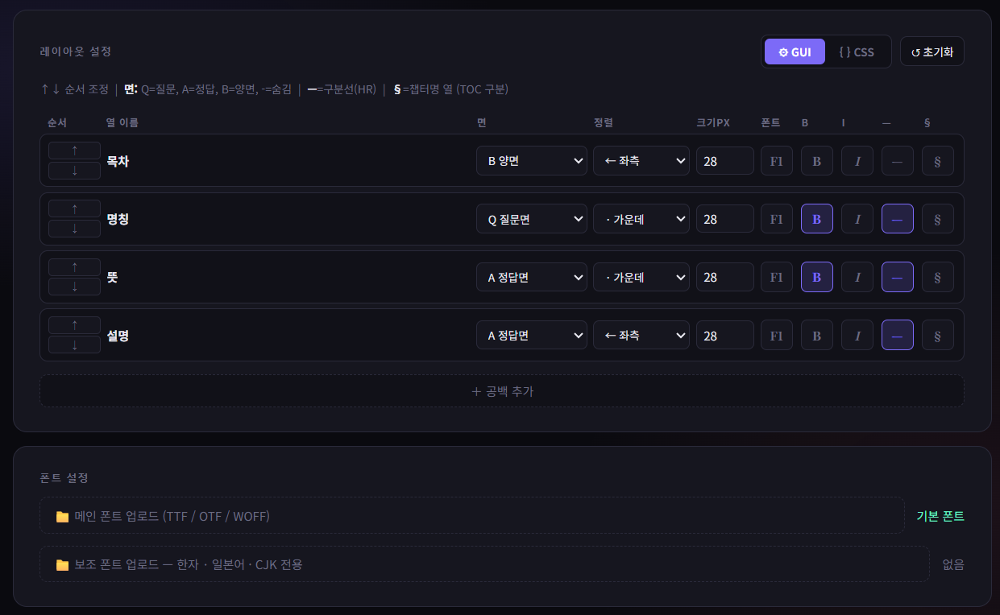

# FlashEPUB v2.1

**Xteink X4 전용 플래시카드 생성기**

CSV / XLSX / TXT 파일을 X4에서 바로 읽을 수 있는 EPUB 또는 XTC 파일로 변환합니다.  
별도 설치 없이 브라우저에서 단일 HTML 파일로 동작합니다.




---

## 모드 구성

FlashEPUB v2.1은 두 가지 모드를 제공합니다.

### Basic 모드 — EPUB 출력

X4의 기본 전자책 뷰어로 읽는 표준 EPUB 2.0 파일을 생성합니다. 레이아웃은 고정되어 있으며 빠르게 사용할 수 있습니다.

| 설정 항목 | 설명 |
|---|---|
| 질문 / 정답 / 힌트 컬럼 | 헤더명 또는 열 번호(1부터)로 지정 |
| 힌트 컬럼 | 선택 항목, 비워두면 생략 |
| 책 제목 / 저자명 | EPUB 메타데이터에 삽입 |
| 구분선 스타일 | 점선 / 대시 / 이중선 중 선택 |

각 카드는 질문 페이지(Q)와 정답 페이지(A)로 나뉘어 저장됩니다. 표지는 캔버스로 자동 생성됩니다.

**지원 입력 형식:** CSV · XLSX / XLS · TXT (탭/파이프/쉼표 구분)

---

### 고급 모드 — XTC 출력

X4 전용 바이너리 포맷인 XTC 파일을 생성합니다. 모든 페이지가 480×800 1bpp 비트맵으로 렌더링되어 X4의 e-ink 화면에 최적화된 레이아웃으로 표시됩니다.

#### 레이아웃 편집기 (GUI 모드)

업로드한 파일의 열(컬럼)마다 다음 속성을 개별 설정할 수 있습니다.

| 속성 | 설명 |
|---|---|
| 면 (Q / A / B / -) | 질문면·정답면·양면 표시 또는 숨김 |
| 정렬 | 좌측 / 가운데 / 우측 / 양쪽 |
| 크기 | 폰트 크기(px), 10–72 |
| 폰트 | F1(메인) / F2(보조) 중 선택 |
| B / I | 굵게 / 기울임 |
| — (구분선) | 해당 열 앞에 수평선(HR) 삽입 |
| § (챕터) | 이 열의 값이 바뀔 때마다 XTC TOC에 새 챕터 추가 |

열 순서는 ↑↓ 버튼으로 조정하며, 〔공백〕 항목을 추가해 열 사이 간격을 픽셀 단위로 지정할 수 있습니다.

#### CSS 템플릿 모드

질문면(Q)과 정답면(A)을 각각 HTML 형식으로 직접 작성합니다. `{{열이름}}` 변수로 셀 값을 삽입하고, `{{font1}}` / `{{font2}}`로 업로드한 폰트를 참조할 수 있습니다. CSS 모드에서도 챕터 열을 드롭다운으로 지정할 수 있습니다.

#### 폰트 업로드

TTF / OTF / WOFF 형식의 폰트를 메인(F1)·보조(F2) 각각 업로드할 수 있습니다. 보조 폰트는 한자·일본어·CJK 문자에 권장됩니다. 업로드한 폰트는 미리보기와 XTC 렌더링 모두에 즉시 반영됩니다.

#### 페이지 분할

내용이 한 페이지(480×800)를 넘으면 자동으로 다음 페이지에 이어서 출력됩니다. 분할된 페이지에는 우하단에 ▼가 표시되며, 카드 번호는 분할 페이지 전체에서 동일하게 유지됩니다(`001/015`).

#### 챕터 TOC

§로 지정한 열의 값이 바뀔 때마다 XTC 파일의 목차(TOC)에 챕터 항목이 추가됩니다. X4의 목차 화면에서 챕터 단위로 바로 이동할 수 있습니다. 챕터 정보는 헤더에 텍스트로만 저장되므로 파일 크기에 미치는 영향은 무시할 수준입니다.

#### 셀 내 줄바꿈

XLSX / CSV 셀 안에서 줄바꿈(Alt+Enter)을 사용한 경우, 미리보기와 XTC 파일 모두에 그대로 반영됩니다.

---

## X4 미리보기

파일을 업로드하면 실제 기기 해상도(480×800, 28px)와 동일한 비율로 미리보기가 표시됩니다. 내용이 길어 페이지가 분할될 경우 컨트롤 바에 `▲ p.1/2 ▼` 버튼이 나타나 서브페이지를 순서대로 확인할 수 있습니다.

---

## XTC 파일 포맷 개요

XTC는 Xteink X4 전용 바이너리 포맷입니다. 내부 구조는 다음과 같습니다.

```
XTC 파일 구조
├── 헤더 (0x38 bytes) — magic "XTC\0", 페이지 수, 섹션 오프셋
├── 제목 (128 bytes)
├── 저자 (128 bytes)
├── TOC 항목 × N (항목당 96 bytes) — 챕터명, 시작/끝 페이지
├── 페이지 인덱스 — [커버 포인터 u64] + [페이지 수 × 16 bytes]
├── 커버 XTG 블록 (48,022 bytes)
└── 컨텐츠 페이지 XTG 블록 × N (페이지당 48,022 bytes)
    └── XTG 헤더 16 bytes + 1bpp 비트맵 48,000 bytes (480×800px)
```

페이지당 용량은 약 47KB이며, 100장 기준 약 9.4MB입니다.

---

## 파일 크기 참고

| 카드 수 | 페이지 수 (분할 없음) | 예상 크기 |
|---|---|---|
| 50장 | 101페이지 | ~4.8MB |
| 100장 | 201페이지 | ~9.6MB |
| 200장 | 401페이지 | ~19MB |
| 500장 | 1,001페이지 | ~47MB |

내용이 길어 페이지가 분할되면 그만큼 파일 크기가 증가합니다. 200MB 초과 시 생성이 중단됩니다.

---

## 사용 방법

1. `index.html`을 브라우저에서 엽니다 (Chrome 권장).
2. 모드를 선택합니다 — 빠른 시작은 **Basic**, 레이아웃 커스텀은 **고급**.
3. CSV / XLSX / TXT 파일을 드래그하거나 클릭해서 업로드합니다.
4. 설정을 조정하고 미리보기에서 확인합니다.
5. **EPUB 생성** 또는 **XTC 생성** 버튼을 눌러 파일을 다운로드합니다.
6. 다운로드된 파일을 X4에 복사합니다.

---

## 입력 파일 형식

### CSV
첫 행이 헤더로 처리됩니다. 셀 내 쉼표는 큰따옴표로 감싸 처리합니다.

```
question,answer,hint,chapter
Bill of Lading,선하증권,B/L,Chapter 1
```

### XLSX / XLS
첫 번째 시트의 첫 행이 헤더로 처리됩니다. 셀 내 줄바꿈(Alt+Enter)을 지원합니다.

### TXT
첫 행의 구분자를 자동 감지합니다 (탭 → 파이프 → 쉼표 순).

---

## 변경 이력

### v2.1

- **Basic 모드 구분선 수정** — v1.x와 동일한 출력 결과로 통일 (미리보기·EPUB 모두 반영)
- **Basic 모드 구분선 옵션 정리** — 대시(---) 옵션 제거, 점선(...)·이중선(====================) 두 가지만 유지
- **고급 모드 챕터 TOC 수정** — 같은 카드번호의 Q면·A면·서브페이지 전체가 동일 챕터에 포함되도록 페이지 범위 계산 수정


### v2.0
- **XTC 바이너리 출력** — 실제 X4 포맷으로 전면 재구현 (기존 JSON zip 방식 폐기)
- **고급 모드** — 다중 열 레이아웃 편집기, CSS 템플릿 모드 추가
- **챕터 TOC** — § 버튼으로 열을 챕터 키로 지정, XTC 목차 자동 생성
- **페이지 자동 분할** — 내용 넘침 시 다음 페이지로 자동 분리, ▼ 표시
- **폰트 업로드** — TTF/OTF/WOFF 메인·보조 폰트 적용
- **셀 내 줄바꿈 지원** — XLSX Alt+Enter 줄바꿈 반영
- **미리보기 개선** — 서브페이지 네비게이션(▲/▼), 실기기 비율 일치
- **표지 자동 생성** — 제목·카드 수 표시 커버 페이지

### v1.x
- Basic 모드 EPUB 출력 (단일 파일, 2컬럼 Q/A 구조)
